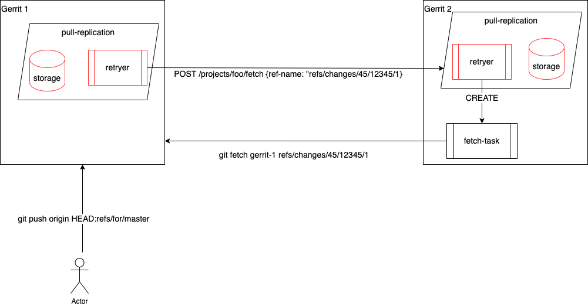
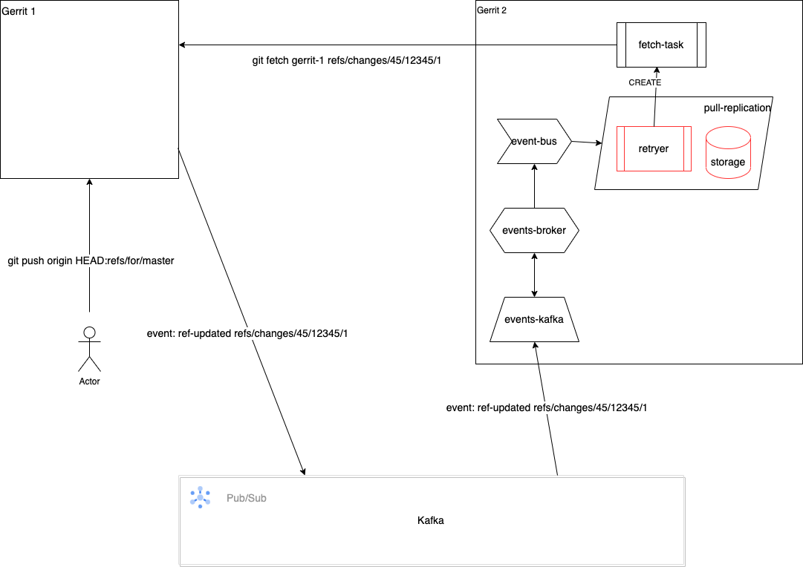
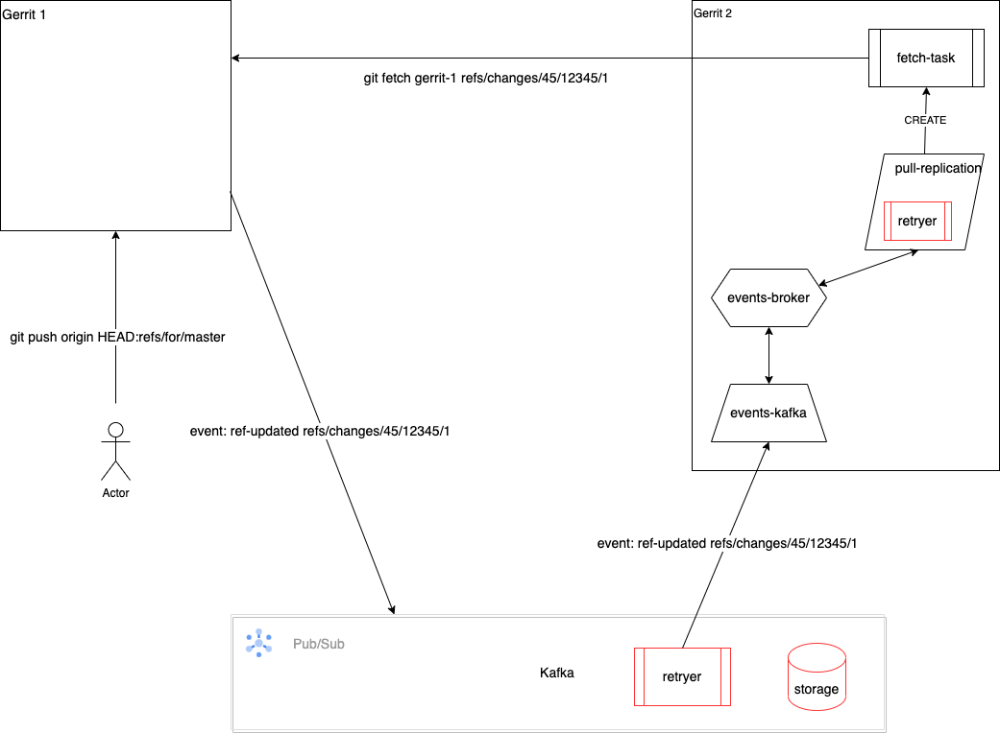
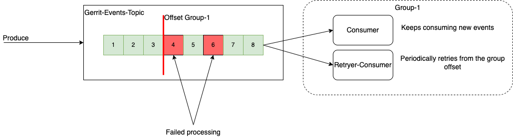
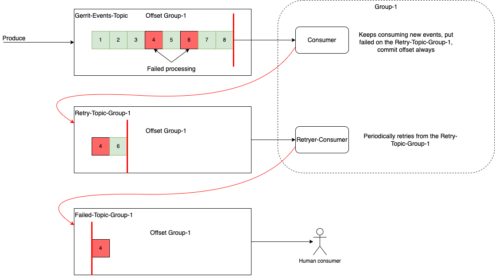
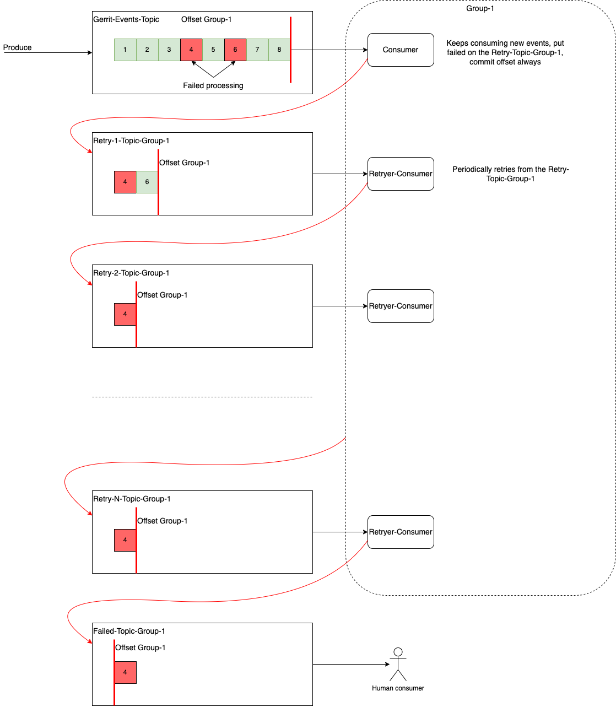

# Plugin Design

## Objective

Provide low-latency, resilient replication between Gerrit master/replica servers.
Utilize git-fetch instead of git-push for performing replication.

## Overview

### The traditional replication plugin
The traditional replication plugin is designed so that it utilizes git-push to perform replication.
The responsibility of the replication tasks creation, retrying and persistence is at the pushing
side of the replication.

The achieve higher throughput the replication plugin merges pending replication tasks for the same
remote repository into a single git-push command by delaying the execution of a push task and then
merging any follow-up replication tasks for the same remote repository. This strategy was
necessary to compensate for often slowly performing push, especially with repositories containing
a large number of refs. For a repository with >500K refs, the replication latency is often in
the several minutes area.

The plugin code which handles replication delays, task merging, task persistence and task retrying
is a very complex code, hard and risky to change and extend.

The task persistence is implemented in the replication plugin itself.

### Performance of git-fetch vs git-push
Git protocol V2 provides significant performance improvements for the git-fetch operation,
especially for repositories with a large number of references. Where a push command could take
minutes, the equivalent fetch command could take below a second.  If we utilize git-fetch instead of
git-push for performing replication tasks we can significantly reduce replication latency. 

## Design

### Creation, retrying and persistence of the fetch tasks
When a ref-update occurs in a master Gerrit server we can think of several ways to create
fetch tasks in the replication receiving Gerrit servers.

If a fetch task cannot be performed for some reason, for example if the remote is not reachable, the
pull-replication plugin should retry the tasks after some delay. It should keep retrying the fetch
task until it succeeds or until the task finally gets declared as failed. In the latter case
typically a human needs to inspect the issue.

#### An explicit REST API call to the receiving Gerrit server which would tell it to perform a fetch

Using the REST API to notify the receiving site to create a fetch task would require to implement
the retry logic also in the REST request sending site. If the REST request sending site cannot reach
the receiving site it would need to keep retrying. This would require book-keeping of the replication
tasks for each remote and also persistence of such tasks so that they also can be retried if the
plugin gets restarted.

Once the REST request is sent, the receiving site will create a fetch task. That fetch task may also
fail, for example if the remote site is temporarily unavailable. This means that we would also need
a retry and persistence of the fetch tasks at the fetching site.

#### Listen to the Gerrit events at the receiving site, using the event-bus, and create fetch tasks

Listening on Gerrit events to create fetch tasks would relieve the event sending site, where the
ref-update was performed, from having to notify each receiving site. The delivery of events to each
listener is guaranteed by the underlying pub-sub system. The receiving site would react on events
and create fetch tasks. Note that once a fetch task is created at the receiving site, the receiving
site is responsible for the retrying of that task. Further, the receiving site would still need to
persist the fetch tasks so that it can restore them after a plugin restart.

#### Use the event-broker API at the receiving site, consume events and create fetch tasks

Using the event-broker API, or the underlying pub-sub system directly, we can utilize the pub-sub
system both as the task storage and the retry mechanism. For example, this could be achieved by
committing the offset in the pub-sub topics only when a fetch-task gets finished.
This approach can significantly simplify the retry logic in the pull-replication plugin and
eliminate the need for implementing task persistence in the plugin.

##### Retrying using one topic and controlling the offset

We do not want to stop processing of new events when processing of one event fails. In the diagram,
the processing of the events 4 and 6 failed but the "Consumer" consumer keeps processing the new
events. This ensures that the replication is not blocked when one fetch task fails.

There are a couple of challenges with this approach.  The "Retryer-Consumer" periodically retries
from the last committed group offset. The retryer shall avoid re-processing already successfully
processed events. Further, which of the consumers shall be responsible for committing the offset.
Obviously, the "Consumer" consumer can only keep committing the offset until it hits a first fetch
task which fails. The "Retryer-Consumer" is likely a better candidate for committing the offset.
However, depending on how often the retryer runs, the offset may be kept uncommitted for longer than
necessary when all events are being processed successfully.

##### Retrying using a retry topic

With this approach the offset in the main topic is committed every time an event is consumed and
processed. The processing of an event is considered done when either:
* the fetch task is created and executed successfully
* the fetch task failed and the consumer event is put on the retry topic

The "Retryer-Consumer" consumes events from the retry topic periodically. The processing of a
retried event can succeed, fail and permanently fail. When processing fails the event is put back to
the retry topic, to be retried again.

An event is retried for a predefined number of times and a predefined period of time. Eventually, an
event may be declared as permanently failed and put on the failed topic. The events which reached
the failed topic need to be inspected by a human.

Note, that the "Retry-Topic-Group-1" is consumer specific, we need such a retry topic for each
consumer. This may require an extension in the events-broker API to enable creation of consumer
specific topics.

##### Retrying using multiple retry topics

This approach is similar to the previous approach but it utilizes a (fixed) number of retry topics
where each retry topic represents a phase in the exponential backoff retry algorithm. A failed
task moves from one to the next retry topic until it either gets successfully processed or it
reaches the failed topic.
